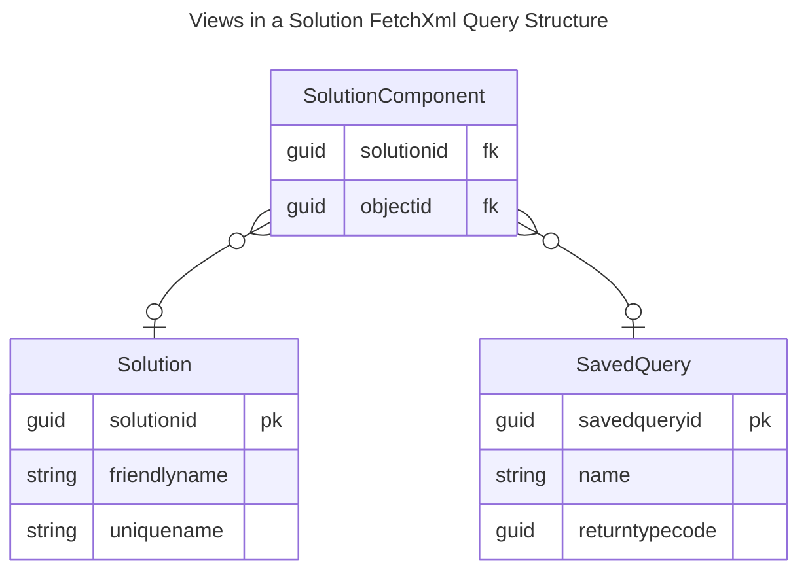

https://www.d365freelancing.com/post/query-all-entities-in-a-dataverse-solutions
https://www.d365freelancing.com/post/query-views-in-power-platform-using-fetchxml

#ERD of System Views in a Solution.

